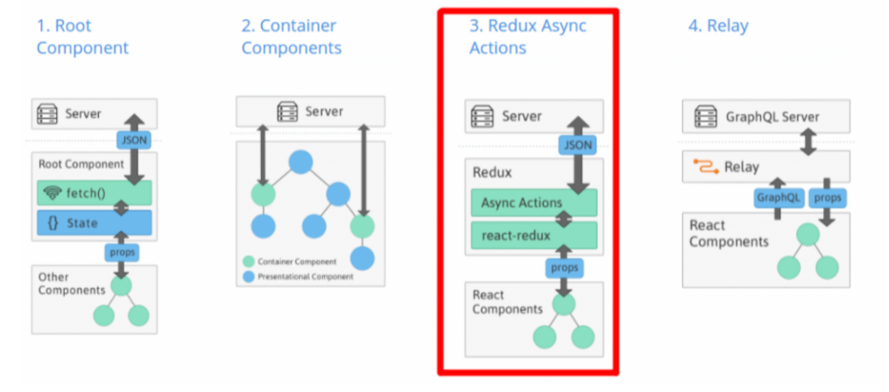
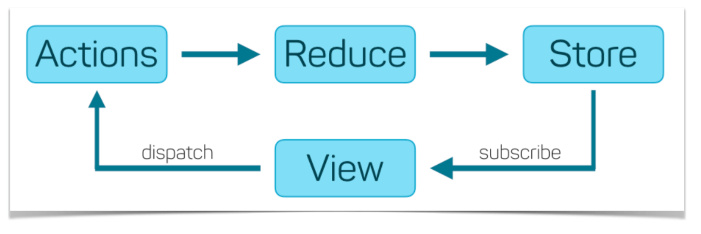

# React and Redux: fundamental and advanced

_June 2021_

> 🔨 From udemy '[Reactv16 & intégration Redux : fondamentaux et avancé - Sandy Ludosky](https://www.udemy.com/course/reactv16-integration-redux-fondamentaux-et-avance)'.

<h1 align="center">
    
</h1>

_Redux is a predictable state container for JavaScript apps. It’s a « state container » because it holds all the state of your application. It doesn’t let you change that state directly, but instead forces you to describe changes as plain objects called « actions ». Actions can be recorded and replayed later, so this makes state management predictable. With the same actions in the same order, you’re going to end up in the same state._ (Dan Abramov)

<h1 align="center">
    
</h1>

<h1 align="center">
    
</h1>

<h1 align="center">
    
</h1>

**Actions**

Actions are JavaScript objects that use type property to inform about the data that should be sent to the store.

**Reducers**

While actions only trigger changes in the app, the reducers specify those changes. The reducer is a function that takes two parameters (state and action) to calculate and return an updated state.

**Store**

The store is a place that holds the app's state.

<h1 align="center">
    
</h1>

<h1 align="center">
    
</h1>

## Dependancies

- [redux](https://www.npmjs.com/package/redux): Redux is a predictable state container for JavaScript apps.

`npm i redux`

- [react-redux](https://www.npmjs.com/package/react-redux): Official React bindings for Redux.

`npm i react-redux`

- [redux-thunk](https://www.npmjs.com/package/redux-thunk): Redux Thunk middleware allows you to write action creators that return a function instead of an action. The thunk can be used to delay the dispatch of an action, or to dispatch only if a certain condition is met. The inner function receives the store methods dispatch and getState as parameters.

`npm i redux-thunk`

## Useful links

- [Getting Started with Redux](https://redux.js.org/introduction/getting-started)
- [Developing modern offline apps with ReactJS, Redux and Electron – Part 3 – ReactJS + Redux](https://blog.codecentric.de/en/2017/12/developing-modern-offline-apps-reactjs-redux-electron-part-3-reactjs-redux-basics/)
- [The New York Times Developer Network](https://developer.nytimes.com/apis)
- [Redux](https://redux.js.org/)
- [Utiliser Redux avec React JS](https://www.softfluent.fr/blog/utiliser-redux-avec-react-js/)
- [Build fast, responsive sites with Bootstrap](https://getbootstrap.com/)
- [Flat UI Color 2](https://flatuicolors.com/)
