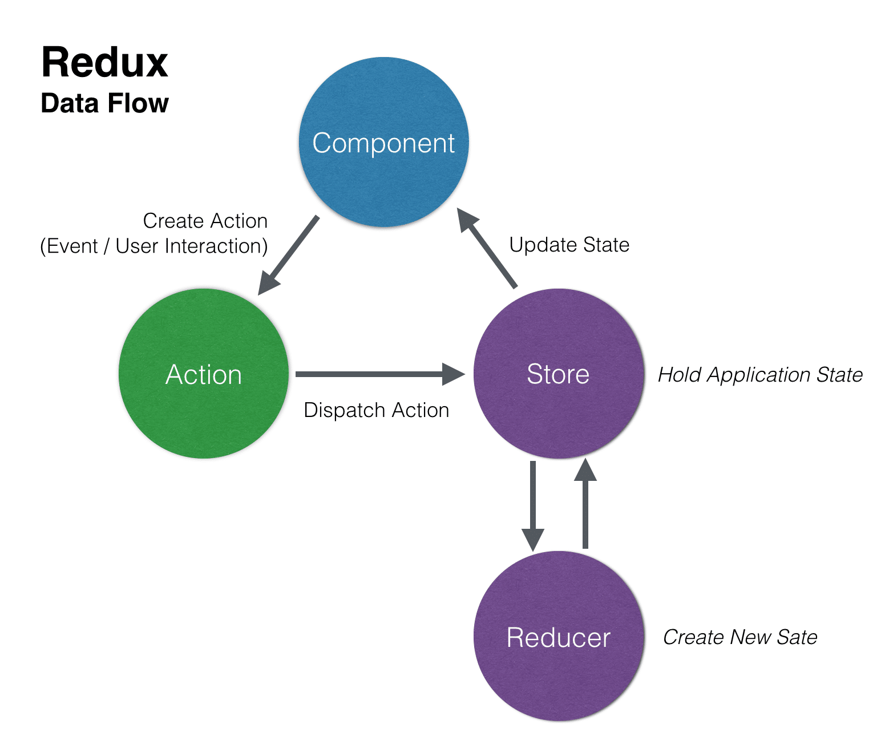

# React and Redux: fundamental and advanced

_June 2021_

> 🔨 From udemy '[Reactv16 & intégration Redux : fondamentaux et avancé - Sandy Ludosky](https://www.udemy.com/course/reactv16-integration-redux-fondamentaux-et-avance)'.

<h1 align="center">
    
</h1>

Redux is a predictable state container for JavaScript apps.

It helps you write applications that behave consistently, run in different environments (client, server, and native), and are easy to test. On top of that, it provides a great developer experience, such as live code editing combined with a time traveling debugger.

<h1 align="center">
    
</h1>

<h1 align="center">
    
</h1>

## Useful links

- [Getting Started with Redux](https://redux.js.org/introduction/getting-started)
- [Developing modern offline apps with ReactJS, Redux and Electron – Part 3 – ReactJS + Redux](https://blog.codecentric.de/en/2017/12/developing-modern-offline-apps-reactjs-redux-electron-part-3-reactjs-redux-basics/)
- [The New York Times Developer Network](https://developer.nytimes.com/apis)
- [Build fast, responsive sites with Bootstrap](https://getbootstrap.com/)
